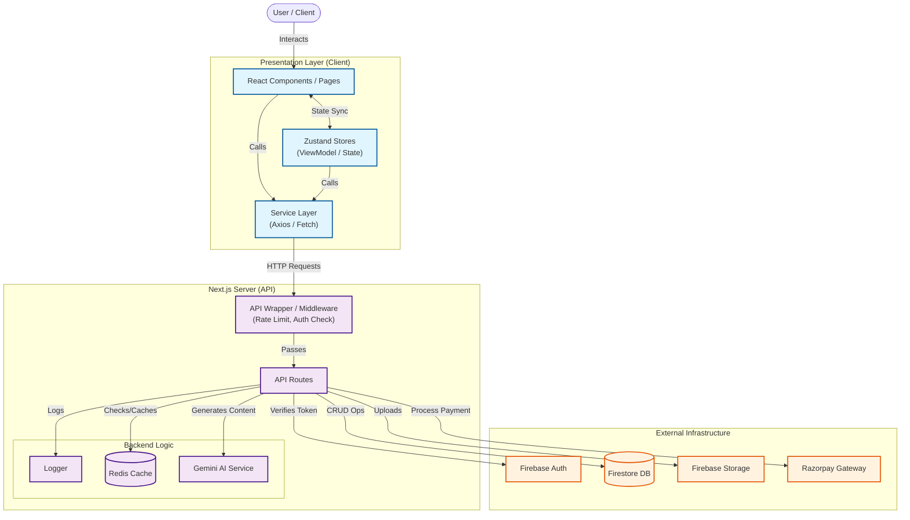

# Golden Zaika - Food Delivery Application

A modern, full-stack food delivery application built with **Next.js 15**, **Firebase**, and **Razorpay**. This project has been streamlined from a previous microservices architecture into a unified, high-performance serverless-style application.

## 🚀 Tech Stack

- **Framework:** [Next.js 15](https://nextjs.org/) (App Router)
- **Styling:** [Tailwind CSS v4](https://tailwindcss.com/)
- **State Management:** [Zustand](https://github.com/pmndrs/zustand)
- **Backend / Database:** Firebase (Firestore, Auth, Storage)
- **Payments:** Razorpay
- **UI Components:** Lucide React, Framer Motion, GSAP

## 🏗️ Architecture

The application uses a serverless architecture where Next.js handles both the frontend UI and the backend API routes. The system incorporates **Zustand** for state management, **Redis** for caching, and **Gemini AI** for intelligent features.



## ✨ Key Features

### 👤 User App Features

- **Authentication System:**

  - Secure phone number and email based login protected by Firebase Authentication.
  - Profile management for addresses and personal details.

- **Smart Menu & Discovery:**

  - **Dynamic Catalogue:** Real-time synchronized menu with category filtering.
  - **Smart Search:** AI-powered search to find dishes by ingredients (e.g., "spicy chicken with rice").
  - **Personalized Recommendations:** AI suggestions based on order history and preferences.

- **Ordering Experience:**
  - **Cart Management:** Persistent cart state using local storage and Zustand.
  - **Seamless Checkout:** Integrated Razorpay payment gateway for secure transactions.
  - **Real-time Tracking:** Live order status updates (Pending -> Processing -> Out -> Delivered).
  - **Order History:** Detailed history of past orders with re-order functionality.

### 🛡️ Admin Dashboard (`/admin`)

- **Operational Control:**

  - **Order Management:** View all incoming orders in real-time. Update statuses to keep users informed.
  - **Menu Management:** Add, edit, or delete items. Upload images directly to Firebase Storage.
  - **Service Zones:** Define delivery zones and operational hours.

- **Analytics & Insights:**

  - **Dashboard:** Visual graphs showing revenue trends, top-selling items, and active user counts.
  - **Report Generation:** Export order data for offline analysis.

- **Customer Support:**
  - **Message Center:** View and reply to customer inquiries directly from the dashboard.

### 🤖 AI Integration (Gemini)

The application leverages **Google Gemini AI** to enhance the user experience:

- **Nutritional Analysis:** Automatically generates nutritional facts (calories, protein, etc.) for menu items based on descriptions.
- **Smart Recommendations:** Suggests dishes to users based on their browsing patterns and past orders.
- **Content Generation:** Auto-generates appetizing descriptions for new menu items added by admins.
- **Intelligent Search:** Natural language search capabilities allowing users to describe what they crave.

## 🛠️ Getting Started

### Prerequisites

- Node.js 18+
- Firebase Project credentials
- Razorpay Account credentials

### Installation

1. **Clone the repository**

   ```bash
   git clone https://github.com/yourusername/golden-zaika.git
   cd golden-zaika
   ```

2. **Install dependencies**

   ```bash
   npm install
   ```

3. **Environment Setup**
   Create a `.env` file in the root directory and add your credentials:

   ```env
   # Firebase
   NEXT_PUBLIC_FIREBASE_API_KEY=your_api_key
   NEXT_PUBLIC_FIREBASE_AUTH_DOMAIN=your_project.firebaseapp.com
   NEXT_PUBLIC_FIREBASE_PROJECT_ID=your_project_id
   # ... other firebase config

   # Razorpay
   NEXT_PUBLIC_RAZORPAY_KEY_ID=your_key_id
   RAZORPAY_KEY_SECRET=your_key_secret
   ```

4. **Run Locally**
   ```bash
   npm run dev
   ```
   Open [http://localhost:3000](http://localhost:3000) to view the app.

## 📂 Project Structure

```
GoldenZaika/
├── src/
│   ├── app/              # App Router Pages & API Routes
│   ├── components/       # Shared UI Components
│   ├── services/         # API Service Layer
│   ├── lib/              # Utility libraries (Firebase, etc.)
│   └── store/            # Zustand Store
├── public/               # Static Assets
├── .env                  # Environment Variables
├── next.config.js        # Next.js Configuration
└── README.md             # Project Documentation
```
